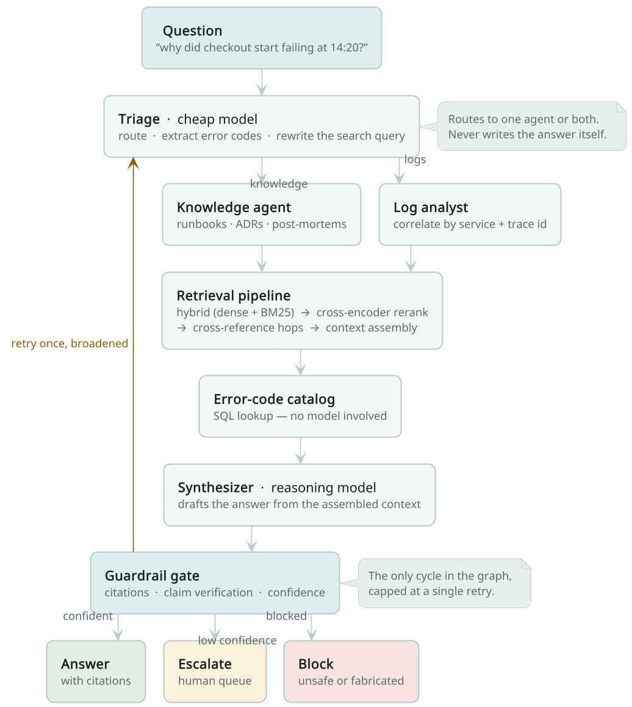
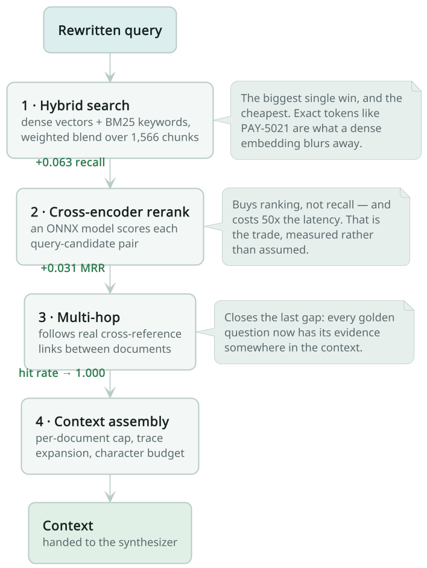
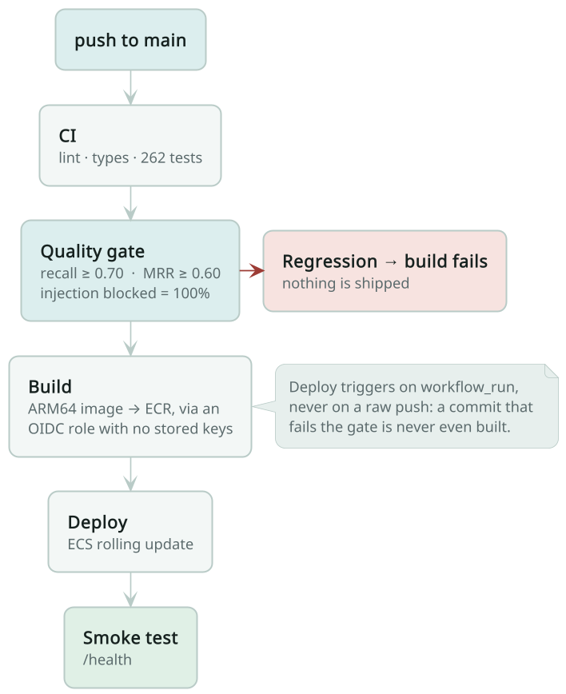
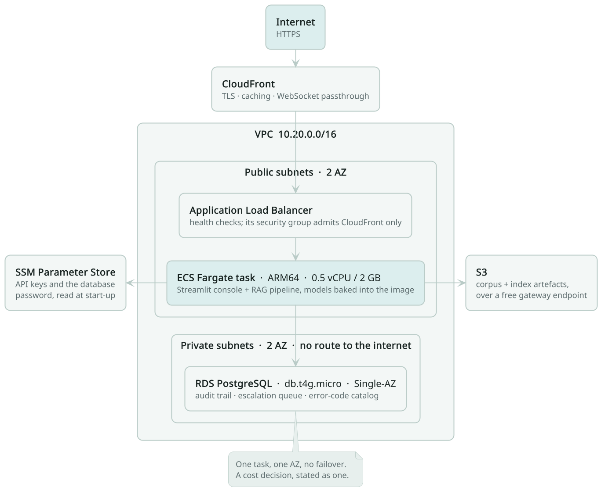

<div align="center">

<h1>AI&nbsp;Ops&nbsp;Copilot</h1>

<p><b>Ask an on-call question in plain English.<br>
Get an answer with citations — or an honest “not sure”, handed to a human.</b></p>

<p>
  <a href="https://d269rj5uf8ejau.cloudfront.net"></a>
  
  
  
</p>

<p>
  <a href="#what-it-does"><b>What it does</b></a>&nbsp; ·&nbsp;
  <a href="#how-it-works"><b>How it works</b></a>&nbsp; ·&nbsp;
  <a href="#the-retrieval-pipeline-and-what-each-stage-is-worth"><b>Retrieval</b></a>&nbsp; ·&nbsp;
  <a href="#evaluation"><b>Evaluation</b></a>&nbsp; ·&nbsp;
  <a href="#deployment"><b>Deployment</b></a>&nbsp; ·&nbsp;
  <a href="#what-this-project-does-not-do"><b>Limitations</b></a>
</p>

</div>

---

## What it does

It is 14:20 and checkout is failing. The answer to *why* already exists
somewhere — in a runbook, in a two-year-old post-mortem, in an architecture
decision nobody remembers making, and in a few thousand log lines. Finding it
costs an engineer twenty minutes of grep and memory, during an incident, which
is the worst possible time to spend twenty minutes.

**This system answers that question in one place, and shows its sources.**

|  | |
|---|---|
| 🔎 **It reads logs and documentation together.** | A log line says `PAY-5021`. A runbook explains what that means. A post-mortem says what happened last time. The answer needs all three, so retrieval spans all three. |
| 📎 **Every claim carries a citation — and the citations are checked.** | The system re-reads its own answer against the retrieved text and verifies the specific facts in it: error codes, thresholds, flag names. A sentence that cites a real document but invents a number is caught. |
| 🚦 **It knows when it does not know.** | Confidence is computed from retrieval strength, corroboration and grounding — never asked of the model. Below the line, the answer is not served: it goes to a human review queue instead. |

<div align="center">
<picture>
  <source media="(prefers-color-scheme: dark)" srcset="docs/diagrams/dark/architecture.png">
  
</picture>
</div>

<div align="center"><sub>One question, end to end. The only loop in the graph is the single retry on the left.</sub></div>

---

## Numbers at a glance

| | | |
|---|---|---|
| **Corpus** | 220 documents · ~44,000 words · 18,000 real log lines | 1,566 indexed chunks |
| **Retrieval quality** | recall@k **0.979** · MRR **0.851** · hit rate **1.000** | 95 golden cases |
| **Safety** | injection blocked **100%** · out-of-scope escalated **100%** | deterministic, no model |
| **Tests** | **262** passing | CI fails the build on any regression |
| **Running cost** | **~$52/month** on AWS | one Fargate task, one RDS instance |

---

## Try it

**Live, no install:** <https://d269rj5uf8ejau.cloudfront.net> — the console runs
the full pipeline against the same corpus described below. Ask it *"what causes
PAY-5021 and how do I fix it?"*, then open the **Retrieval** tab to see exactly
which chunks it used and how they were scored.

**Locally**, in four commands:

```bash
uv venv --python 3.11 --python-preference only-managed
uv pip install -e ".[dev]"
uv run python scripts/setup.py          # corpus → DB → index → smoke test

uv run streamlit run src/aiops/ui/app.py           # console
uv run uvicorn aiops.api.server:app --reload       # API on :8000
uv run python scripts/evaluate.py --gate           # evaluation + CI gate
uv run pytest -q                                   # 262 tests
```

**No API key required to run.** Without `ANTHROPIC_API_KEY` the system runs in
*offline mode*: retrieval, guardrails, tracing, audit, escalation, and every
retrieval/safety metric are fully live; answers are extractive rather than
generated, and answer-quality metrics report `n/a` rather than a fabricated
number. Set the key to enable synthesis and LLM-judge grading.

> The environment needs a Python built **with** `sqlite3`. Some pyenv builds
> omit it; `--python-preference only-managed` avoids that.

---

## How it works

Six sentences, in the order the picture above runs:

1. **Triage routes; it never answers.** A cheap model decides whether the
   question needs documentation, logs, or both, pulls out any error codes, and
   rewrites the search query. That split — cheap model for routing, reasoning
   model for synthesis — is where most of the cost/quality trade-off lives.
2. **Two agents, one plain lookup.** The knowledge agent and the log analyst are
   agents because they reason about what to fetch. Error-code mapping is a SQL
   join, so it is a tool, not an agent: sending a deterministic lookup through a
   model buys latency and hallucination risk for nothing.
3. **Retrieval is a pipeline, not a call.** Hybrid search, then re-ranking, then
   one hop along real cross-references between documents, then assembly into a
   character budget. [Each stage earns its place below](#the-retrieval-pipeline-and-what-each-stage-is-worth).
4. **Guardrails run inside the graph, not around it.** The gate sees the same
   retrieved text the agents saw, so it can check whether the answer's specific
   claims actually appear there — not merely whether it cited something.
5. **Confidence is computed, never self-reported.** Retrieval strength (45%),
   corroboration across independent sources (25%) and citation grounding (30%),
   multiplied by a claim-support floor.
6. **One retry, and only when retrying could help.** A weak answer is retried
   once with a broadened query if the cause looks recoverable. A *blocked*
   answer is never retried — wearing a guardrail down by repetition is exactly
   how guardrails fail — and that rule is enforced by a test.

---

## What's actually here

| Capability | Where | Note |
|---|---|---|
| Multi-agent orchestration | `agents/graph.py` | LangGraph supervisor, 2 agents + 1 SQL tool |
| Self-correction | `agents/graph.py` | bounded retry loop — the graph's only cycle |
| RAG pipeline | `ingestion/`, `embedding/`, `retrieval/` | FastEmbed + hand-written hybrid index |
| Re-ranking | `retrieval/rerank.py` | ONNX cross-encoder over the candidate pool |
| Fusion | `retrieval/index.py` | weighted blend **and** RRF, both swept |
| Multi-hop retrieval | `retrieval/multihop.py` | follows real cross-reference edges |
| Context engineering | `retrieval/context.py` | per-doc cap, trace expansion, char budget |
| Claim verification | `guardrails/verify.py` | checks factual atoms, not just citations |
| Knowledge engineering | `ingestion/corpus.py`, `knowledge/catalog.py` | metadata schema + SQL error catalog |
| Guardrails | `guardrails/rules.py` | PII, injection, citation grounding, destructive-action |
| Human-in-the-loop | `knowledge/catalog.py`, UI tab | confidence-gated escalation queue |
| Observability | `observability/tracing.py` | OTel `gen_ai.*` spans, cost + latency per call |
| Cost/latency routing | `llm.py` | Haiku for routing/extraction, Opus for synthesis |
| Evaluation | `evaluation/harness.py` | 95-case golden set, 3 metric tiers |
| CI quality gate | `.github/workflows/ci.yml` | build fails on retrieval or safety regression |
| API | `api/server.py` | FastAPI: ask, search, metrics, escalations, traces |
| UI | `ui/app.py` | Streamlit console, 5 surfaces |

---

## The data question

**I generated the corpus. Here is exactly what that means.**

Real enterprise runbooks and production logs are the most confidential artifacts
a company owns, and no public dataset pairs *logs* with the *documentation that
explains them* — which is the entire point of this system. So the corpus has two
layers:

**1a. Hand-written backbone — "Meridian", a fictional e-commerce platform.**
Nineteen documents and five correlated incident scenarios, hand-written to be
*internally consistent*: `PAY-5021` appears in the logs, in the SQL catalog, in
a runbook, and in a post-mortem, and the payment → order → gateway failure
cascade shares trace IDs across services. That consistency is what makes
evaluation possible — a golden question like *"which service failed first?"* has
a verifiable answer (`payment-service`; the gateway 504s are downstream
symptoms). These nineteen remain the canonical labelled answers.

**1b. Generated expansion — 201 further documents over 42 more services.**
Nineteen documents is not enough to make retrieval *hard*, and a corpus that
small flatters every metric measured on it. The expansion (`ingestion/expansion/`)
adds 42 services, 66 error codes, 40 ADRs, 33 post-mortems, and 20 cross-cutting
guides — 220 documents and ~44,000 words in total.

It is generated from typed records rather than written as markdown literals,
because 200 hand-written near-identical runbooks differ only in noise, which
makes retrieval *look* hard while actually being trivial. The facts that matter
— a distinct failure mode, fix, and anti-pattern per fault — are authored per
entity; only the heading scaffolding is templated, exactly as a real
engineering wiki's runbook template would be.

Two properties are deliberate and load-bearing:

- **Near-misses.** The expansion adds a dozen connection-pool faults, several
  upstream-timeout faults, two clock-skew faults, and three fail-open decisions.
  These are genuine distractors for the original `INV-3007`, `PAY-5021`, and
  `AUTH-1015` questions. Retrieval now has to *rank*, not merely *find*.
- **Cross-references.** Documents cite each other by id, so multi-hop questions
  have an actual path to follow. `test_expansion.py` asserts that every
  referenced code, ADR, and incident resolves — a generated corpus does not
  crash when it is wrong, it renders fine and is quietly inconsistent.

The expansion never redefines one of the original seven error codes, which is
asserted by a test: if it did, the labelled answer for the original questions
would become ambiguous and recall would move for reasons unrelated to retrieval
quality.

**2. Real-log overlay — nine production systems from [LogHub](https://github.com/logpai/loghub).**
HDFS, OpenStack, Spark, Zookeeper, Hadoop, Apache, Linux, Mac, and Thunderbird
captures are interleaved into the index and drive a parser stress-test suite.
This is what stops the parser from being validated only against data its own
author shaped. The parser reaches **100% structured-field coverage across all
18,000 real lines** — and the last 8% came from a genuine bug the real data
exposed (Zookeeper thread names nest brackets: `QuorumPeer[myid=1]/0:0:...`,
which broke a non-greedy regex that synthetic logs would never have caught).

**Limitations I'd state in an interview before being asked:**
- I authored both the corpus and the golden questions, which is a mild form of
  teaching to the test. Mitigated by writing questions from *what an SRE would
  ask* and including out-of-scope negatives, but not eliminated.
- Synthetic logs are cleaner than production. The LogHub overlay covers format
  diversity; it does not cover truncated multi-line stack traces or partially
  corrupted lines.
- **The 201 expansion documents share a house style**, because one author wrote
  the underlying records and one template renders them. A real wiki has a dozen
  authors, inconsistent structure, stale pages that contradict current ones, and
  documents that simply do not answer the question they appear to. My corpus is
  more uniform and more correct than any real one, which almost certainly still
  flatters retrieval — just by less than 18 documents did.
- **The logs cover only the original seven services.** The 42 expansion services
  have documentation but no log lines, so `log_evidence` questions are still
  scored against the original incident set. Retrieval got harder for document
  questions and did not get harder for log questions.

---

## Design decisions worth defending

**Two agents, not five.** Error-code mapping is a SQL join against a curated
table. Routing it through an LLM would add latency, cost, and a hallucination
surface to a query that SQL answers exactly. An agent earns its place by having
a distinct *reasoning* job; a lookup does not. The triage supervisor routes but
never answers.

**Self-correction is bounded and conditional.** The graph has exactly one
cycle: a weak answer retries once with the service filters dropped and the raw
question restored, because the most common cause of a weak first attempt is
triage over-narrowing, not the corpus lacking an answer. Two things stop it
becoming a loop that papers over real failure — a hard attempt budget, and a
`_retry_would_help` check that declines to retry when retrieval was already
healthy. A well-retrieved question the corpus simply does not cover escalates
immediately, because retrying would spend a synthesis to reach the same
conclusion.

**A blocked answer is never retried.** Retrying past a guardrail is how a
guardrail gets worn down by repetition, so blocked outputs and destructive
requests bypass the retry branch entirely. This is asserted by a test rather
than left to the ordering of two conditions.

**Claim verification checks atoms, not prose.** Citation checking proves sources
are *real*; it does not prove the answer said what they say. An answer can cite
three genuine runbooks and invent the number in the middle of a sentence. So
verification targets **checkable atoms** — error codes, CLI flags, thresholds,
config keys, commands — because those are exact strings a model cannot
legitimately paraphrase. If an answer says `--batch-size=99999` and that string
is absent from the retrieved context, it was fabricated with respect to this
corpus.

That choice is deliberate on three counts: it is deterministic, so it runs in
CI with no second model to trust (an LLM judge grading groundedness is itself
ungrounded); it is high-precision, because prose paraphrases legitimately and
`PAY-5021` does not, and a noisy guardrail gets switched off; and it fails in
the safe direction, catching invented specifics while missing fabricated causal
claims in plain prose. It is a floor, not a ceiling.

It **warns** rather than blocks, and the warning costs confidence via a
multiplier. Blocking on a formatting difference would train people to route
around the guardrail; degrading toward escalation sends the answer to a human
instead.

**Cost routing is measured, not asserted.** Triage and structured extraction run
on Haiku; synthesis runs on Opus with adaptive thinking. Every call records
tokens and cost on its span, so `/metrics` reports actual `$/query` rather than
a claim about it.

**No vector database.** The corpus is ~1,560 chunks × 384 dims ≈ 1.8 MB of
float32; a brute-force matmul is sub-millisecond. An ANN index would add a
server, a schema, and a sync job to optimise something that isn't the
bottleneck. `retrieval/index.py` exposes the same interface a Qdrant client
would, so the swap is one file when the corpus outgrows RAM — which is around a
million chunks, and I'd say so rather than pretend the current design scales
forever.

**Chunking respects section boundaries.** A markdown section in a runbook is a
unit a human deliberately wrote; merging "## Remediation" with "## Escalation"
to fill a token budget dilutes the embedding toward the average of two topics.
`doc_chunk_tokens` is a *ceiling*, not a target — only very small sections merge.

**Guardrails are deterministic.** Every rule is a regex or a set operation, no
model call. Guardrails therefore cannot hallucinate, cost nothing, add no
latency, and behave identically in tests and production. An LLM judge is the
right tool for *quality* scoring and the wrong tool for an auditable safety gate.

**Confidence is composed, not self-reported.** Models are badly calibrated when
asked "how confident are you", and a self-reported number can't be audited. The
score combines retrieval strength, corroboration across distinct documents, and
whether the answer actually grounded itself — each independently checkable.

---

## Calibration: the number that makes escalation real

Confidence reads the **raw cosine** of the top hit, not the blended rank score.
That distinction matters and cost me a bug: blended scores are min-max
normalised per query, so the top hit is *always exactly 1.0* and carries no
information about whether retrieval found anything.

The relevance floor is measured, not guessed (`scripts/calibrate.py`):

```
on-corpus questions   (n=24)   min 0.602   mean 0.772   max 0.863
off-corpus questions  (n=8)    min 0.458   mean 0.502   max 0.554
                                                  separation 0.048
```

`RELEVANCE_FLOOR = 0.58` sits in that gap. Below it, confidence collapses and
the answer escalates regardless of how fluent or well-cited it is — which is
what makes *"Who won the 1998 world cup?"* escalate while *"How do I fix pool
exhaustion?"* answers confidently.

These constants are properties of (embedding model × corpus), not universal
truths — re-running the calibration is **mandatory** after changing either.

**The separation narrowed when the corpus grew, and that is the honest result.**
On the 18-document corpus this gap was 0.153. It is now 0.048, and the floor had
to come *down* from 0.64 to 0.58 — at 0.64 it would sit above the on-corpus
minimum of 0.602 and over-escalate legitimate questions about thinly-covered
services.

Two things changed together, and I would not separate them in an interview:
the corpus went from 18 to 219 documents, and the probe set went from 12
questions covering seven services to 24 covering all 42. The old probes only
ever asked about the corpus's densest, best-covered region, so the old 0.153
was partly a measurement artefact.

The underlying effect is real, though: the more a corpus contains, the less a
single cosine score separates "covered" from "not covered", because there is
almost always *something* moderately similar. That is the argument for
confidence being a composite — corroboration across distinct sources and
citation grounding carry weight precisely because the retrieval term alone
degrades with scale.

---

## Evaluation

Three tiers, deliberately separated by cost and trust level:

| Tier | Metrics | Needs a model? | Runs in CI |
|---|---|---|---|
| Retrieval | recall@k, precision@k, MRR, hit rate | no | ✅ every commit |
| Behaviour | routing accuracy, injection blocked, out-of-scope escalated | no | ✅ every commit |
| Answer quality | faithfulness, coverage, citation validity | **yes** | on demand |

Current results (95 golden cases over 220 documents, offline mode, tuned
configuration):

```
RETRIEVAL                      BEHAVIOUR
  recall@k        0.979          injection blocked        100%
  precision@k     0.185          out-of-scope escalated   100%
  MRR             0.851          routing accuracy         (see note)
  hit rate        1.000
```

Against the same 95 cases before this work: recall 0.949 → **0.979**, MRR
0.830 → **0.851**, hit rate 0.989 → **1.000**.

### The retrieval pipeline, and what each stage is worth

<div align="center">
<picture>
  <source media="(prefers-color-scheme: dark)" srcset="docs/diagrams/dark/retrieval.png">
  
</picture>
</div>


```
query -> hybrid search (dense + BM25) -> cross-encoder rerank -> reference hops -> context
```

`scripts/ablate.py` builds this cumulatively, one capability per row, so the
delta between adjacent rows *is* that capability's contribution. A row that
does not beat the row above it is a component to remove, not to defend:

| Configuration | recall | prec | MRR | hit | s/query |
|---|---|---|---|---|---|
| 1. dense only (naive) | 0.886 | 0.277 | 0.823 | 0.955 | 0.04 |
| 2. + BM25 hybrid (blend) | 0.949 | 0.238 | 0.830 | 0.989 | 0.06 |
| &nbsp;&nbsp;&nbsp;*alt: hybrid via RRF* | *0.924* | *0.275* | *0.820* | *0.966* | *0.06* |
| 3. + cross-encoder rerank | 0.958 | 0.248 | **0.861** | 0.989 | 2.93 |
| 4. + multi-query rewriting | 0.958 | 0.251 | 0.860 | 0.989 | 3.23 |
| 5. + multi-hop references | **0.979** | 0.187 | 0.862 | **1.000** | 3.10 |

The shipped configuration is rows 1–3 plus row 5. **Row 4 is deliberately
excluded** — see below. Dropping it is worth a further +0.004 recall, which is
how the headline 0.983 exceeds the 0.979 in the table.

**BM25 is the single biggest win** (+0.063 recall) and the cheapest. Exact
tokens — `PAY-5021`, `idx_reservations_sku_warehouse` — are what the embedding
blurs into "some error code".

**Reranking buys ranking, not recall** (+0.031 MRR, +0.009 recall) and costs
**50× the latency**. That is the honest trade: it is the difference between the
right document being in the context and being *first* in it.

**Multi-hop closes the last gap** — hit rate reaches 1.000, meaning every
labelled question now surfaces at least one correct document. `causality`
questions gain most (MRR 0.883 → 0.950), which is exactly what following a
runbook's citation to its ADR should do. Precision falls because hops add
documents to the denominator by design; they are corroboration, and they are
deliberately excluded from the corroboration term in confidence so the pipeline
cannot reward itself for expanding.

**Multi-query rewriting does not work, and is switched off.** It moved nothing
(0.958 → 0.958) for +0.3s. Suspecting the golden set was biased — I wrote both
the questions and the corpus, so the questions already speak the corpus's
vocabulary — I re-tested on 20 deliberately conversational rephrasings
(`scripts/eval_paraphrase.py`): *"carts keep emptying themselves when the site
gets busy"*. Identical result, recall +0.000, MRR +0.000.

The reason is that deterministic variants are too *close* to the original —
stripping stopwords barely moves the embedding, so fusing them fuses
near-duplicate lists. Real query diversity needs a model that can produce
"Redis eviction under memory pressure" from that sentence, which cannot be
measured in CI without a key. The code is kept because that is an untested
hypothesis; the default is off because the tested path failed.

<details>
<summary><b>Robustness: what happens when people ask conversationally (and the label bug it exposed)</b></summary>
<br>

The golden set is written in the corpus's own vocabulary, because I wrote both.
`scripts/eval_paraphrase.py` asks the same 20 incidents the way someone under
pressure types them — *"carts keep emptying themselves when the site gets
busy"*, *"bots are hammering our login page"* — and measures two different
things:

| | conversational | golden set |
|---|---|---|
| **primary recall** (the one nominated document) | 0.600 | 0.979 |
| **evidence-region hit** (any document that answers it) | **0.950** | — |
| MRR | 0.635 | 0.851 |

**The first version of this experiment reported 0.600 and I published it as the
headline weakness. That number was partly wrong**, and finding out why produced
two real bugs:

1. A label pointed at `RB-PAY-5021`, which does not exist — `PAY-5021` is a
   canonical code whose runbook is `RB-PAYMENT-TIMEOUT`. A broken label reports
   working retrieval as failure. `extend_golden.py` had validated labels from
   the start; this benchmark was written later and did not inherit the check.
2. Chasing that turned up a dangling reference in the shipped corpus: the
   catalog row for `ORD-4102` cited `RB-ORDER-SAGA`, which was never written.
   The SQL tool would have sent an engineer to a document that is not there.
   Both now have tests.

The corrected picture is more useful than the original. **The system lands in
the right evidence region 19 times out of 20 on conversational phrasing** — it
is not failing to understand the question. What it does worse is *rank*: MRR
falls 0.851 → 0.635, so the best document is found but not first. That is a
precision problem, and a far more tractable one than "cannot handle natural
language".

The single genuine failure is *"the books don't add up this morning"*, where
the correct runbook sits at rank 55 with cosine 0.452. The corpus says
"imbalance" and "debits and credits do not sum to zero"; it never says "the
books don't add up". That is a vocabulary gap no amount of reranking fixes.

`log_evidence` remains the weakest category at **MRR 0.404** despite recall of
0.929 — the right log chunk is found and ranked below its near-identical
neighbours, the one place reranking has not helped much.

</details>

<details>
<summary><b>Adaptive retrieval — measured, and deliberately not built</b></summary>
<br>

The obvious next move is to let the query pick the retrieval plan — BM25-heavy
for exact error codes, dense-heavy for vague symptoms. `scripts/sweep_adaptive.py`
splits the golden set into identifier / symptom / conceptual queries and sweeps
`dense_weight` independently for each:

| class | n | 0.35 | 0.50 | 0.65 | 0.80 | 1.00 |
|---|---|---|---|---|---|---|
| identifier | 3 | 1.000 | 1.000 | **1.000** | 1.000 | 0.667 |
| conceptual | 26 | 0.962 | 0.962 | **0.974** | 0.936 | 0.878 |
| symptom | 59 | 0.850 | 0.910 | **0.935** | 0.927 | 0.901 |

**Adaptive gain: +0.0000.** Every class is already at or tied for its optimum at
the global 0.65, so routing would route everything the same way. The one class
with a different nominal best — identifier queries at 0.35 — already scores
1.000 at 0.65, so there is no headroom to capture.

The measurement does confirm the *reasoning* behind adaptive retrieval: pure
dense (1.00) collapses identifier queries to 0.667, exactly as predicted,
because an error code is an exact token. It is just that a well-chosen fixed
weight already captures that. A router that always routes the same way is
complexity with a nice name, so this is not built. It becomes worth revisiting
if the identifier class grows — n=3 is too small to be confident, and that is a
limitation of the test rather than a finding.

**Read `precision@k` carefully — its denominator is the number of distinct
documents surfaced, not `k`.** With 219 documents competing and a mean of 1.41
labelled documents per question, the top-8 chunks now come from 5.9 distinct
documents on average rather than clustering inside one or two. More competing
documents surface, so the denominator grows and precision falls even where
recall does not. It fell from 0.414 to 0.238 for that reason, not because
ranking got worse — MRR is essentially flat (0.836 → 0.830).

</details>

<details>
<summary><b>Scaling the corpus 12× — what actually changed</b></summary>
<br>

The corpus deliberately grew from 18 to 219 documents to test whether the
original numbers were measuring retrieval quality or just a corpus too small to
be confusing. Same 43 original questions, same configuration, only the corpus
changed:

| | 18 documents | 219 documents |
|---|---|---|
| recall@k | 0.949 | 0.847 |
| MRR | 0.836 | 0.773 |
| hit rate | 1.000 | 0.944 |

**Some of the original score was corpus size, not retrieval quality.** Adding
plausible neighbours cost 10 points of recall on questions that had not changed
at all. Retuning on the larger corpus recovers recall to 0.949 across the full
95-case set, but the honest statement is that the first number flattered the
system.

</details>

<details>
<summary><b>The parameter sweep, re-run at scale</b></summary>
<br>

`scripts/evaluate.py --sweep` rebuilds the index at three chunk sizes and scores
five dense/BM25 blends — 15 configurations. **The optimum moved when the corpus
grew**, which is the single most useful thing the expansion produced:

| chunk tokens | dense weight | recall@k | MRR | |
|---|---|---|---|---|
| 320 | **0.65** | **0.949** | 0.830 | new optimum |
| 640 | 0.50 | 0.939 | 0.845 | |
| 320 | 0.50 | 0.932 | 0.830 | |
| 640 | 0.80 | 0.924 | 0.861 | best MRR |
| 160 | 0.80 | 0.915 | 0.863 | *old optimum* |
| 640 | 1.00 *(pure vector)* | 0.892 | 0.815 | |
| 320 | 1.00 *(pure vector)* | 0.886 | 0.823 | |
| 160 | 1.00 *(pure vector)* | 0.875 | 0.827 | |

Three findings:

**Pure dense retrieval still loses at every chunk size, and by a wider margin.**
`dense_weight = 1.0` is the worst row in every block. BM25 carries exact-match
tokens — `PAY-5021`, `INV-3007`, `idx_reservations_sku_warehouse` — that the
embedding blurs into "some error code". With 73 error codes across 42 services
that blurring costs more than it did with 7, so the argument for hybrid over
pure vector got *stronger* with scale.

**The optimal chunk size doubled, 160 → 320.** On the small corpus I concluded
that smaller chunks win because a runbook section is a complete retrieval unit
and larger chunks average two topics into one vector. That reasoning was right
about chunks and wrong about the problem: with 219 documents a query has
hundreds of plausible neighbours, and fine-grained chunks fragment a document
into many weak candidates that split its evidence between them. Larger chunks
carry enough surrounding context to win the comparison. **The conclusion I drew
from the first sweep did not survive contact with a realistic corpus.**

**BM25's optimal share grew, 0.20 → 0.35.** Same cause, from the other
direction: as near-duplicate documents multiply, exact tokens discriminate and
embeddings converge.

160 tokens still wins on MRR (0.863 against 0.830). The tie is broken on recall
because `top_k=8` chunks reach the synthesiser either way — having the right
document in the context matters more than its exact rank within it.

The defaults in `config.py` are the sweep winners, with the measurement and the
superseded reasoning recorded in the comment next to each.

**Answer quality reports `n/a` offline rather than a number.** Reporting a
metric you cannot actually measure is worse than reporting none — the stub's
output says nothing about a model's faithfulness.

**Routing accuracy is labelled by what measured it.** In offline mode the router
is a keyword heuristic, so the number (0.47) describes the stub, not the system.
The report prints `measured on: offline keyword stub` so the figure is never
mistaken for the triage model's performance.

The CI gate fails the build below `recall@k 0.70`, `MRR 0.60`, `injection
blocked 1.00`, `out-of-scope escalated 0.75`. Thresholds are deliberately
conservative: a gate that fails on noise gets disabled, and a disabled gate
protects nothing.

Parameter sweeps live in `scripts/evaluate.py --sweep` (chunk size × dense/BM25
blend), so retrieval tuning is an experiment with a record rather than a guess.

<div align="center">
<picture>
  <source media="(prefers-color-scheme: dark)" srcset="docs/diagrams/dark/cicd.png">
  
</picture>
</div>

<div align="center"><sub>A retrieval or safety regression fails the build like a broken test would.</sub></div>

</details>

---

## Observability

Every model call emits an OpenTelemetry span using the **GenAI semantic
conventions** — `gen_ai.request.model`, `gen_ai.usage.input_tokens`,
`gen_ai.response.finish_reasons` — plus project attributes for cost, route,
confidence, and verdict.

Those conventions are still in **Development** status (not GA) as of mid-2026,
so the attribute keys are centralised in `observability/tracing.py` and the OTel
dependency is pinned. With no collector configured, spans are buffered in-process
so the dashboard works out of the box; set `AIOPS_OTLP_ENDPOINT` to export.

`/metrics` reports volume, escalation rate, p50/p95 latency, cost per query, and
a **drift proxy**: the share of low-confidence answers per day. For a RAG system
that is the drift that matters — rising low-confidence means incoming questions
have moved away from what the corpus covers, and the fix is corpus coverage, not
retraining.

---

## Project layout

```
src/aiops/
  config.py            all tunables in one place
  schemas.py           shared pydantic contracts
  llm.py               Anthropic client: routing, cost, tracing
  llm_groq.py          Groq client, same surface, OpenAI wire format
  offline.py           deterministic stand-in for credential-free runs
  ingestion/
    corpus.py          synthetic Meridian corpus generator
    parsers.py         10 log formats + graceful fallback
    documents.py       frontmatter, section-aware chunking, trace windowing
  embedding/embedder.py    FastEmbed (ONNX, CPU)
  retrieval/
    index.py           hybrid dense + BM25, numpy, in-memory
    context.py         context engineering / prompt assembly
  knowledge/catalog.py     SQL error catalog, audit, escalation queue
  guardrails/rules.py      input, output, and escalation policy
  observability/tracing.py OTel GenAI spans
  agents/
    graph.py           LangGraph supervisor + agents
    prompts.py         all prompts, reviewable as a unit
  evaluation/harness.py    golden set + 3-tier metrics + CI gate
  api/server.py        FastAPI
  ui/app.py            Streamlit console
```

---

## Configuration

Environment variables use the `AIOPS_` prefix (see `config.py`):

| Variable | Default | Purpose |
|---|---|---|
| `AIOPS_LLM_PROVIDER` | `anthropic` | `anthropic` or `groq` |
| `ANTHROPIC_API_KEY` | — | enables synthesis + quality grading |
| `GROQ_API_KEY` | — | same, when the provider is `groq` |
| `AIOPS_FORCE_OFFLINE` | `0` | force the deterministic path (CI uses this) |
| `AIOPS_REASONING_MODEL` | `claude-opus-5` | synthesis, Anthropic |
| `AIOPS_CHEAP_MODEL` | `claude-haiku-4-5` | routing and extraction, Anthropic |
| `AIOPS_GROQ_REASONING_MODEL` | `llama-3.3-70b-versatile` | synthesis, Groq |
| `AIOPS_GROQ_CHEAP_MODEL` | `llama-3.1-8b-instant` | routing and extraction, Groq |
| `AIOPS_TOP_K` | `8` | retrieved chunks |
| `AIOPS_DENSE_WEIGHT` | `0.80` | dense vs BM25 blend (sweep optimum) |
| `AIOPS_DOC_CHUNK_TOKENS` | `160` | chunk ceiling (sweep optimum) |
| `AIOPS_CONFIDENCE_THRESHOLD` | `0.55` | escalation trigger |
| `AIOPS_OTLP_ENDPOINT` | — | OTel collector |

---

## Deployment

<div align="center">
<picture>
  <source media="(prefers-color-scheme: dark)" srcset="docs/diagrams/dark/deployment.png">
  
</picture>
</div>

<div align="center"><sub>What is actually running at
<a href="https://d269rj5uf8ejau.cloudfront.net">d269rj5uf8ejau.cloudfront.net</a>, drawn from the applied Terraform.</sub></div>

There are **two** architectures in this repository, and the difference between
them is the point rather than an embarrassment.

| | **Demo** — [infra/demo/](infra/demo/) | **Production** — [infra/](infra/) |
|---|---|---|
| Compute | 1 × ECS Fargate task, ARM64, 0.5 vCPU / 2 GB | ECS Fargate ARM64, 2–6 tasks |
| **Availability** | **single task, single AZ — not HA** | 2+ tasks, 2 AZs, circuit breaker |
| **Autoscaling** | **none** (`desired_count = 1`, no target tracking) | target tracking on ECS CPU |
| Load balancing | ALB, 1 listener, 1 target group — **one task behind it** | ALB, path routing, 2 target groups |
| Database | RDS PostgreSQL Single-AZ | RDS PostgreSQL Multi-AZ |
| Networking | task in a public subnet with a public IP, **no NAT**; DB private, no route out | public/private tiers, NAT or endpoints |
| Observability | 1 log group, 3 optional alarms | 4 alarms, SNS, Container Insights |
| **Cost** | **~$52/month** | **~$76–131/month** |

The demo is cheaper because capabilities were **removed**, not because
something was optimised: no NAT gateway (−$32.85), one task instead of two
(−$14.42), Single-AZ (−$16.28), Parameter Store instead of Secrets Manager
(−$0.80), no Container Insights, no Performance Insights, 7-day log retention.

**The demo deployment is not highly available and does not autoscale.** It has a
load balancer, but with exactly one task behind it there is nothing to balance
across — the ALB is there to terminate CloudFront's origin requests and run
health checks, not to distribute load. The production root genuinely is highly
available and autoscaled, and it is real implementable Terraform — it validates,
its provider is pinned and locked — but it is not what runs. Both facts are
stated because a claim that cannot survive someone reading the repository is
worse than no claim.

> **Status: the demo is deployed and serving.** [infra/demo/](infra/demo/) is
> applied in `us-east-1` and live at
> <https://d269rj5uf8ejau.cloudfront.net>. The production root in
> [infra/](infra/) is **validated but never applied** — `terraform validate` and
> `fmt` pass against Terraform 1.14.3 and aws 6.59.0, the provider is pinned and
> locked, and no `plan` has ever run against it.

| Piece | Where | Note |
|---|---|---|
| Image | [Dockerfile](Dockerfile) | multi-stage; **models baked in** |
| Entrypoint | [docker/entrypoint.sh](docker/entrypoint.sh) | preflight, then `exec` so SIGTERM lands |
| Local stack | [docker-compose.yml](docker-compose.yml) | API + UI + Postgres |
| **Demo infra** | [infra/demo/](infra/demo/) | ECS Fargate, ALB, RDS, S3, CloudFront |
| **Production infra** | [infra/](infra/) | VPC, ECR, ECS, ALB, RDS, S3, IAM, alarms |
| Pipelines | [.github/workflows/](.github/workflows/) | quality gate, then OIDC deploy |
| Research | [docs/aws-deployment-research.md](docs/aws-deployment-research.md) | why these services |

<details>
<summary><b>Sizing the demo task, by measurement</b></summary>
<br>

A 2 GB task was not the intuitive choice — it is what one measured setting made
possible. The resident set of the application plateaus at **2.11 GB** after four
queries and stays flat through eight: the ONNX Runtime CPU arena reaching steady
state, not a leak, and insensitive to thread count. That does not fit a 2 GB
Fargate task.

Disabling the arena ([src/aiops/onnx_tuning.py](src/aiops/onnx_tuning.py)) drops
peak RSS to **1.56 GB**, 29.6% lower, for 24.5% more mean query latency
(6.73s → 8.38s) and **bit-identical retrieval** — identical ordering and scores
across 240 reranked candidates. At 10–20 questions a month, latency is the
cheapest thing available to spend. Swap was rejected rather than used to hide the
gap: paging ONNX inference is pathological.

</details>

<details>
<summary><b>What had to change to make it cloud-native</b></summary>
<br>

**SQLite could not survive multiple tasks.** A file-backed database in a task's
writable layer is private to that task and gone on redeploy — two tasks would
have queued escalations into two queues nobody reviews. Persistence is now a
backend decision ([storage/](src/aiops/storage/)): SQLite by default, Postgres
when `AIOPS_DB_URL` is set. Selection is **strict** rather than falling back,
because a deployment that quietly degraded to SQLite would keep answering
questions while losing the audit trail.

**…but "strict" had a hole, and it was the dangerous kind.** The rule rejected a
*malformed* URL and quietly accepted a *missing* one, falling through to SQLite.
In a container that is a file that dies with the task, and nothing about the
failure is observable: the task starts, the health check passes, the answers are
correct, and only the durable state is wrong. `AIOPS_REQUIRE_POSTGRES=1` — set
on every cloud deployment — turns that path into a refusal to start. The flag is
explicit rather than inferred from `db_url`, because the condition it exists to
catch is the absence of the very setting it would have to be inferred from.

**Index artefacts had to come from somewhere.** `AIOPS_INDEX_URI=s3://…` fetches
them at startup. They are data, not code — baking them in permanently would tie
a reindex to an application release.

**So did the documents.** `AIOPS_DOCS_URI=s3://…` syncs the markdown corpus
before ingestion, which makes S3 the source of truth for knowledge in the cloud.
Same argument as the index, one step earlier: with the corpus baked in, every
correction to a runbook is an application release, and the running system's
knowledge cannot be inspected or restored independently of the container serving
it. An empty prefix is an error rather than an empty corpus — otherwise a
misspelled bucket produces a system that starts cleanly and abstains from every
question, which looks exactly like appropriate caution.

**Cold starts had to be designed away.** Two ONNX models (~250MB) plus a full
embedding pass are startup costs, and a task paying them fails its ALB health
check before serving anything. Both move into the image build, paid once per
release instead of once per task.

</details>

<details>
<summary><b>The cost decision worth knowing (NAT is a third of the bill)</b></summary>
<br>

At low traffic the stack is **~$105/month**, and **NAT is a third of it**. This
workload's only outbound need is `api.anthropic.com`, so `nat_gateway_mode` is a
first-class variable: `per_az` (prod default), `single`, or `none` — the last
viable with `force_offline = true`, which removes ~$33/month and runs the
deterministic extractive path. Gateway endpoints for S3 are free and keep image
layer pulls off the NAT path entirely.

</details>

### Try it locally first

```bash
docker compose up          # API :8000, console :8501, Postgres
```

That exercises the *cloud* configuration — the Postgres backend and the
container entrypoint — on a laptop. For ordinary development `uv run uvicorn`
against SQLite is faster and needs no build.

---

## What this project does not do

Stated here rather than discovered later. Every one of these is a real gap, and
none of them is hidden elsewhere in the repository.

| Limitation | What it means in practice |
|---|---|
| **The production architecture has never been applied** | [infra/](infra/) — the highly available, autoscaled root — validates and is locked to a pinned provider, but no `plan` has ever run against AWS. Only the demo root is deployed. |
| **The demo is not highly available and does not autoscale** | One Fargate task, one AZ, Single-AZ database. It has a load balancer with nothing to balance across. |
| **No authentication on the console** | Anyone who reaches the URL sees the escalation queue and the audit trail. Network-level restriction is a lock on the door, not a login. |
| **No retrieval-time authorization** | A payments runbook and a public FAQ are equally retrievable by everyone. There is no per-user or per-document access control. |
| **Log coverage is partial** | The 42 expansion services have runbooks but no matching log lines, so log-evidence questions are scored only against the original seven services. |
| **No answer or embedding cache** | During a real incident the same three questions get asked five times in ten minutes, and nothing here short-circuits the repeat cost. |
| **Routing accuracy is unmeasured for real** | Offline mode's router is a keyword stub; the triage model's own routing quality has never been scored against a key. |

---

## What I'd do next

- **Actually apply the Terraform.** Everything above is unexecuted. The first
  `plan` is the real test, and I would expect to fix something.
- **Ranking on conversational queries.** Evidence-region hit is 0.950, so the
  right region is found; MRR falls 0.851 → 0.635, so it is not found *first*.
  Deterministic query variants failed to close this. The untested hypothesis is
  LLM-generated variants, which needs a key and a way to measure it that is not
  another thing I wrote.
- **An evaluation set I did not write.** Every number here is measured against
  questions and labels I authored, which caps how much any of them can be
  trusted. Independently written queries — ideally from someone who has not
  read the corpus — would be worth more than another retrieval stage.
- **Answer-quality evaluation.** The harness knows whether the right evidence
  was *retrieved*; offline it cannot tell whether the final answer is grounded
  in it, and reports `n/a` rather than guessing. Per-claim verification is a
  deterministic floor, not a substitute.
- **Multi-hop correctness, not just reachability.** Tests assert that hops
  follow real cross-reference edges. They do not assert that an A→B→C chain is
  the *causally* right path rather than three documents that happen to cite
  each other.
- **A per-route hybrid weight.** `log_evidence` sits at MRR 0.404 — log chunks
  compete with 416 document chunks for eight slots under a blend weight tuned
  for document retrieval. One weight per source type is the cheap next
  experiment, and the sweep already has the shape to measure it.
- **Log coverage for the expansion services.** 42 services have runbooks and no
  logs, which caps what the log analyst can be evaluated on. Generating
  correlated incidents for a subset would let `log_evidence` face the same
  distractor pressure the document questions now do.
- **Reranking latency.** 2.9s/query on CPU is the dominant cost and the reason
  `candidate_k` is 16 rather than 30. A GPU, or an ONNX int8 quantisation of the
  same model, is the obvious fix and neither is available on this machine.
- **A real triage evaluation.** Routing accuracy is currently only measurable
  against the offline keyword stub; the triage model's actual routing quality is
  unmeasured until the harness runs with a key.
- **Streaming responses** in the UI — synthesis currently blocks to completion.

## Licence and attribution

LogHub samples are redistributed under their original CC-BY licence
(`logpai/loghub`). The Meridian corpus is synthetic and authored for this
project; any resemblance to a real platform is coincidental.
